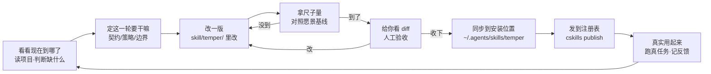

# 淬炼 temper · 自迭代仓库

这是 temper skill 的老家。temper 是干什么的、它怎么迭代自己、现在到哪一步了、你能看到什么 —— 都在这一页。

---

## 一眼看懂：这个项目怎么转

每次迭代，我都是按下面这个圈子走。当前走到哪一步，看这个图里的 ⬤ 在哪。

**当前：⬤ 候选已做好，等你验收**（在 E1）。

---

## 你现在最需要知道的

| 问题 | 答案 |
| --- | --- |
| **skill 主体在哪？** | `skill/temper/` —— 项目里的权威副本，含 SKILL.md + references + agents。改就改这里。 |
| **装的版本是什么？** | 安装位置 `~/.agents/skills/temper` 当前是 **0.0.1**（初版，方法论手册形态）。 |
| **候选改成啥了？** | `方法/候选方法/` 是 **0.1.0** 候选：用户体验层重构（讲人话 + 对话契约），**还没采纳**，等你验收。 |
| **现在到哪一步？** | Epoch 1，候选自评 P0/P1 都消除了，等你人工确认。 |
| **怎么分辨版本？** | 看 `skill/temper/SKILL.md` 的 frontmatter `version`，那是唯一权威。时间线在 `skill/temper/VERSION.md`。 |

---

## 这个仓库是干嘛的

**用 temper 的方法，迭代 temper 自己。**

temper 是给"任务还不稳、但要持续改进"的场景用的 —— 需求会变、方法不稳、评测不全、要业务反馈。这个仓库就是 temper 的第一个真实用例：它自己就处在"方法还没稳定、正在被迭代"的状态。

所以这里不光是 skill 的代码仓库，也是 temper 方法论的活体演示：阶段、强度、策略、Epoch、候选、基线 —— 这些概念在别处是文档，在这里是每天都在发生的事。

---

## skill 主体与版本

### 两个"temper"别搞混

| | 位置 | 角色 | 能不能直接改 |
| --- | --- | --- | --- |
| 权威副本 | `skill/temper/` | 项目里的真身，将来发布源 | **能**（改这里） |
| 部署副本 | `~/.agents/skills/temper` | 各会话实际加载的版本 | **别改**（会被 cskills 覆盖） |

### 版本时间线

| 版本 | 是什么 | 状态 |
| --- | --- | --- |
| 0.0.1 | 初版：概念手册形态 | 安装位置当前版本（注意：注册表上记的 0.0.2，两边漂了，待对齐） |
| 0.1.0 候选 | 用户体验层重构：讲人话 + 交互契约 | `方法/候选方法/`，待验收 |

### 怎么发布一版

改 `skill/temper/` → 验收 → 同步到安装位置 → `cskills publish skill/temper`（发到注册表）→ `cskills sync` 拉回。发布是外发动作，必须你点头才做。

---

## 目录导航

| 你想看什么 | 去哪 |
| --- | --- |
| 现在到哪一步、要你干嘛 | [循环/当前状态.md](循环/当前状态.md) |
| 这个项目自己怎么转 | [循环/循环总览.md](循环/循环总览.md) |
| temper 的定义（现在是什么） | [项目定义/当前定义.md](项目定义/当前定义.md) |
| 当前工作方法（指针） | [方法/当前方法.md](方法/当前方法.md) |
| 候选方法（0.1.0，待你验收） | [方法/候选方法/](方法/候选方法/) |
| 评测尺子和结果 | [评测/评测说明.md](评测/评测说明.md) · [评测/愿景基线对照.md](评测/愿景基线对照.md) |
| 每一代的留痕 | [运行记录/](运行记录/) |
| 机器状态 | [.temper/state.json](.temper/state.json) |
| 设计愿景（为什么做它） | [temper_docs/](temper_docs/) |

---

## 怎么用 temper 来迭代这个仓库

把这个仓库当成一个普通任务交给 temper 就行。你只需要说一句，比如：

> "用 temper 迭代 temper 自己。"

它会按自己的方法走：先看当前状态 → 判断缺什么 → 定一轮要干嘛 → 改 → 拿尺子量 → 给你看 diff。你现在看的所有这些结构（`项目定义/`、`循环/`、`评测/`、`运行记录/`），就是 temper 自己给自己搭的架子 —— 它真用它干活，不是摆设。

---

## 给新来的人

- **别一上来学概念。** Discovery、Epoch、Candidate 这些，等你问"为什么"时再展开。
- **每次进来先看** [循环/当前状态.md](循环/当前状态.md) 和这个 README 的状态块，就知道现在到哪了。
- **看不懂我的措辞，直接说"讲人话"。** 这个仓库的表达本身就还在被迭代。
