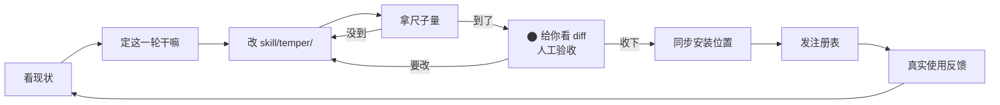

# 循环总览

> 这个项目（用 temper 迭代 temper）自己是怎么转的。⬤ = 当前在哪。

## 现在在哪

**⬤ 给你看 diff，等你验收** —— E1 候选（0.1.0）已在 `方法/候选方法/`，diff 在 `运行记录/0002/版本差异.md`。

## 每个节点解决什么

| 节点 | 防的是什么 |
| --- | --- |
| 看现状 | 别凭感觉瞎改，先读项目 |
| 定这一轮 | 别什么都想做，一轮办一件事 |
| 拿尺子量 | 别"感觉好了"，要能对着尺子说清好在哪 |
| 给你看 diff | 别偷偷改，你说了才算 |
| 真实使用反馈 | 别自证合理，真跑起来才算数 |

## 哪些环节要人（不是每步都要）

| 环节 | 要不要人 |
| --- | --- |
| 看现状 / 定一轮 / 改 / 量 | 不要，AI 自己跑 |
| 给你看 diff | **要**（每轮验收） |
| 收下新版本 | **要**（你点头才采纳） |
| 发注册表 | **要**（外发动作，单独确认） |
| 真实使用反馈 | **要**（你在真实项目里用，把观感记下来） |
