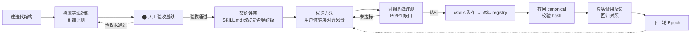

# 循环总览

> 本项目（用 temper 迭代 temper 自己）当前真实循环。图只反映真实存在的节点；当前节点用 ⬤ 标出。

## 当前节点

**⬤ 人工验收基线**（`评测/愿景基线对照.md`）。

## 每个非基础控制的 failure mode

| 节点 | 解决的 failure mode |
| --- | --- |
| 愿景基线对照 | "不知道改没改好" —— 把愿景陈述变成可复核的检查命题 |
| 人工验收基线 | "尺子本身不对" —— 评测口径需人确认才算数 |
| 契约评审 | "偷换尺子" —— 方法改动若改变用户可见行为需 Epoch Review，不混入普通一代 |
| hash 校验 | "发布链漂移" —— 安装位置与远端不一致时能发现（已发现 0.0.1/0.0.2 漂移） |
| 真实使用反馈 | "自证合理" —— 愿景对照是内部尺子，最终以真实使用为准 |
