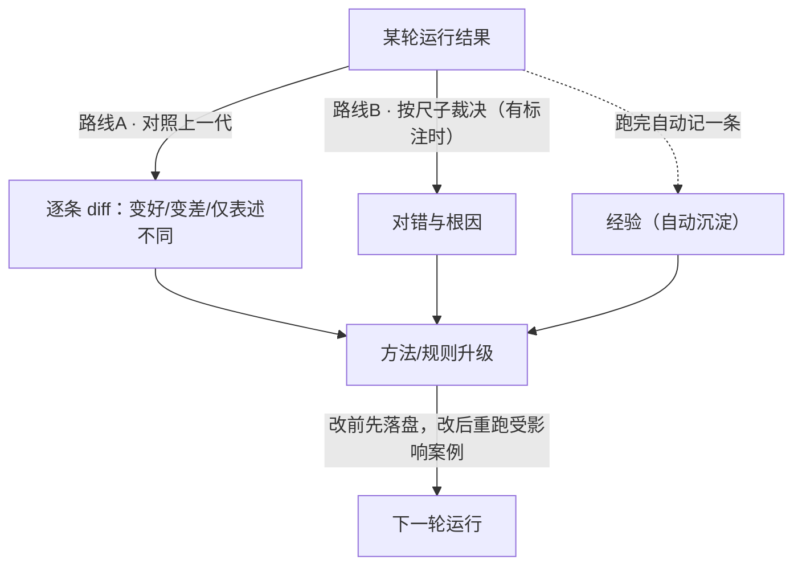

# AI 工作文件模板

> 用途：淬炼在 A/B/C 场景落地结构时，把本模板填成项目根的 `AGENTS.md`（或写入 README.md）。目标：一次性生成，之后任何 AI 会话（即使没加载淬炼）照着它就能按流程干活。五节固定，内容按项目实情填。
> 形态参照：CMES-AI 资讯demo 的 README（执行前必读 + 目录职责 + 循环图 + 当前契约）与《评测闭环·真实流程图》的双路线结构。

---

## 一、这个项目在干嘛

（一句话。例：把顾客评论自动分成好评/差评/退货相关，分类要越来越准。）

**你是用户，你只需要知道**：

- 看现状：打开（状态文件/最新一代记录），第一屏就知道现在到哪了
- 需要你的时候：它缺标注案例、要业务口径、或要做方向选择时会直接问
- 验收：每版一句话"收/退"就够了

## 二、目录职责

| 目录 | 分区职责 |
| --- | --- |
| （如 当前/ 或 prompt.md） | 当前权威：现在生效的方法，全项目只此一份 |
| （如 迭代记录/） | 过程：每代一份——目的/改动/证据/差异/决策 |
| （如 沉淀/） | 沉淀：跨代可复用的观察、教训、模板 |
| （如 基线/ 或 评测/） | 尺子（冻结语义）：判对错的标准，改动需留痕并经用户确认 |
| （如 labs/，可选） | 实验区：不算代际的探索 |

## 三、AI 执行前必读

1. 本文件第五节（当前契约与已知差异）
2. 当前权威区的方法文件
3. 过程区最新一代（最近在干什么、遗留什么）
4. 尺子（什么叫做好）

读完先向用户复述"我理解的现状"，再动手。

## 四、本项目的循环

（按真实路径画，不画理想路径。常见形态：一轮结果的改进信号不止一条路。）

硬规矩（每轮）：跑之前方法先写入文件；跑完立刻对照；每 3-5 代向用户汇报一次。
必须找人的时刻：缺标注、尺子可疑、要动尺子/历史、方向选择。

## 五、当前契约与已知差异

- 现行版本：（例：分类提示词 v0.0.1，位于 当前/prompt.md）
- 尺子：（例：基线/案例集，5 条，待用户裁决后冻结）
- 遗留问题：（例：讽刺识别不稳；退货相关缺口径）
- 当前不能宣称的事：（例：准确率——尚无标注数据，任何"变好了"都只是暂定判断）
